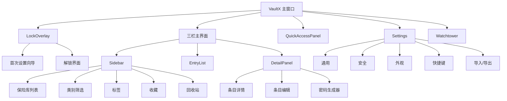
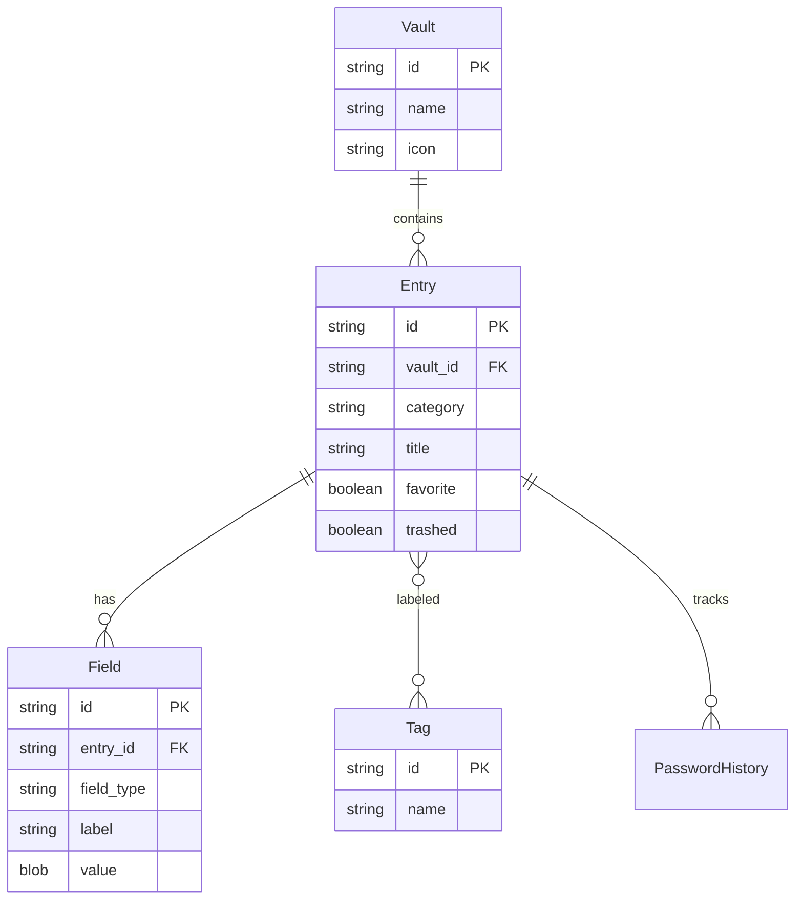
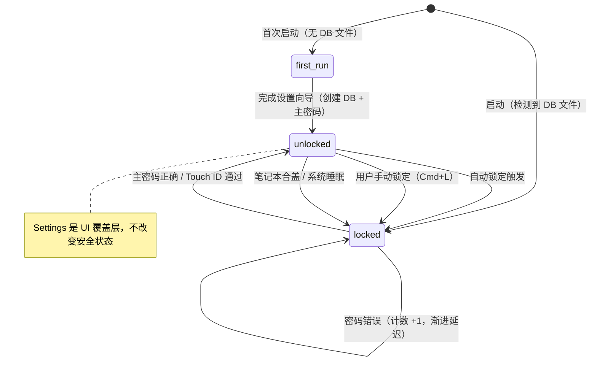

# VaultX Product Spec v1.0

> 产品结构规格：信息架构、用户旅程、状态权限、异常处理。
> 与 `design-spec.md` 互补——本文件管"怎么运转"，那份管"长什么样"。
> AI 生成 UI 代码时必须同时参考两份文件。

---

## 0. 使用说明

### 0.1 标记约定

- `-> DS:x.x` 表示"见 design-spec.md 对应章节"
- `-> PS:x.x` 表示"见本文件对应章节"
- 组件名称使用 §0.2 共享词汇表中的规范名称

### 0.2 共享组件词汇表

> 本文件与 `design-spec.md` 使用相同的组件名称。

| 规范名称 | 含义 | design-spec 章节 |
|---------|------|----------------|
| Modal | 居中对话框 + 遮罩，用于确认/提示 | DS:4.1 |
| Toast | 短暂非阻断消息，自动消失 | DS:4.2 |
| EmptyState | 无数据占位，含插图 + 操作按钮 | DS:4.3 |
| ErrorState | 错误反馈 + 恢复操作 | DS:4.3 |
| Skeleton | 加载占位，匹配内容形状 | DS:4.3 |
| Tooltip | 锚定触发元素的提示气泡 | DS:4.4 |
| ContextMenu | 右键菜单 | DS:4.4 |
| PasswordField | 密码输入/展示（隐藏/显示 + 复制） | DS:4.5 |
| StrengthMeter | 密码强度可视化条（zxcvbn 0-4） | DS:4.5 |
| EntryCard | 条目卡片（图标 + 标题 + 副标题 + 收藏） | DS:4.6 |
| VaultIcon | 保险库图标（emoji 或预设图标） | DS:4.6 |
| CategoryBadge | 条目类别标记 | DS:4.6 |
| CopyButton | 一键复制 + 倒计时反馈 | DS:4.5 |
| LockOverlay | 全屏锁定遮罩 | DS:6.1 |
| QuickAccessPanel | 全局浮窗搜索面板 | DS:6.5 |

当本文件写"弹出 Modal"或"显示 Toast"时，指的是 design-spec 中定义的完整组件及其所有视觉规则。

---

## 1. 产品定义

### 1.1 产品定位

一款 macOS 桌面端的本地优先密码管理器，为重视隐私的个人用户和开发者提供 1Password 级别的 UI 体验，同时保证数据 100% 本地存储、零云端依赖。

### 1.2 目标用户画像

| 画像 | 角色 | 使用场景 | 痛点 | 目标 |
|------|------|---------|------|------|
| 隐私极客 | 技术从业者 | 日常管理数百个网站账号 | 1Password 强制云存储订阅，不信任第三方托管密码 | 完全掌控数据，不依赖任何服务商 |
| 开发者 | 全栈/运维 | 管理 SSH 密钥、API Token、数据库凭证 | KeePassXC 界面老旧，操作繁琐 | 现代 UI + 快速搜索 + SSH Agent 集成 |
| 安全意识用户 | 普通白领 | 多设备间管理个人/工作账号 | 浏览器内置密码管理器功能弱、不安全 | 一个安全、易用、免费的密码管理方案 |

### 1.3 核心价值主张

| 要素 | 描述 |
|------|------|
| 核心价值 | 在不牺牲 UI 体验的前提下，密码数据永远只存在于用户自己的设备上 |
| Aha 时刻 | 用户第一次通过 `Cmd+Shift+Space` 秒速找到一个密码并一键复制 |
| 激活标准 | 用户在首次使用 10 分钟内存入 >= 3 条登录凭证（手动或导入） |

### 1.4 设计哲学：每个接触点减少一步

> 1Password 好用的本质不是某个单一功能，而是在每个用户接触点都减少一步操作或一个决策。VaultX 遵循同样的原则。

| 原则 | 含义 | VaultX 中的体现 |
|------|------|----------------|
| 零配置高安全 | 用户不需要理解安全参数就能达到高安全水平 | Argon2id 参数、AES-256-GCM、自动锁定、剪贴板清除全部使用最佳实践默认值 |
| 一个地方存所有东西 | 用户不需要想"这个信息放哪" | 5 种类型覆盖日常所有敏感信息：登录、银行卡、笔记、身份、SSH 密钥 |
| 让安全可见 | 把安全从抽象概念变成可感知的视觉反馈 | StrengthMeter 实时显示、剪贴板清除 Toast 倒计时、密码遮蔽/揭示动画 |
| 最少步骤达到目的 | 核心操作路径步骤最小化 | Quick Access: 唤出 → 输入 → Enter = 3 步取密码；主窗口复制 = 单击 CopyButton |
| 智能默认不打扰 | 系统做正确的事，用户不需要参与 | 密码生成器默认 20 位强密码、Touch ID 默认开启、主题跟随系统 |

---

## 2. 信息架构

### 2.1 视图层级

VaultX 是单窗口桌面应用，不使用传统的页面路由，而是面板组合模型。

```
VaultX 主窗口
├── [LockOverlay]                     <- 锁定状态：全屏覆盖
│   ├── 首次设置向导
│   └── 解锁界面（密码 + Touch ID）
│
├── [三栏主界面]                       <- 解锁后的常驻布局
│   ├── Sidebar (侧边栏)
│   │   ├── 保险库列表
│   │   ├── 类别筛选（全部/登录/银行卡/笔记/身份/SSH）
│   │   ├── 标签列表
│   │   ├── 收藏
│   │   ├── 回收站
│   │   └── 设置入口
│   │
│   ├── EntryList (条目列表)
│   │   ├── 搜索栏
│   │   ├── 排序控制
│   │   └── EntryCard × N
│   │
│   └── DetailPanel (详情面板)
│       ├── 条目详情（查看模式）
│       ├── 条目编辑（编辑模式）
│       └── 密码生成器（嵌入面板）
│
├── [QuickAccessPanel]                 <- 全局浮窗，独立于主窗口
│
├── [Settings 窗口]                    <- 独立面板或覆盖式设置
│   ├── 通用设置
│   ├── 安全设置（自动锁定、Touch ID）
│   ├── 外观设置
│   ├── 快捷键设置
│   └── 导入/导出
│
└── [Watchtower 面板]                  <- P1，安全审计仪表盘
```



### 2.2 导航模型

VaultX 不使用传统的 URL 路由或 TabBar。导航通过面板切换和视图状态实现。

| 导航方式 | 行为 | 触发 |
|---------|------|------|
| 侧边栏选择 | 切换 EntryList 的数据源（按保险库/类别/标签过滤） | 点击侧边栏项 |
| 条目选择 | 切换 DetailPanel 显示的条目 | 点击 EntryCard |
| 模式切换 | DetailPanel 在查看/编辑模式间切换 | 点击编辑按钮或双击条目 |
| 设置入口 | 打开 Settings 面板（覆盖 DetailPanel 或独立窗口） | 侧边栏底部齿轮图标 |
| Quick Access | 弹出全局浮窗搜索 | `Cmd+Shift+Space` |
| 键盘导航 | 上下箭头在 EntryList 中移动选择 | 方向键 |
| 搜索 | 聚焦搜索栏并过滤条目 | `Cmd+K` 或点击搜索栏 |

### 2.3 内容模型

> 实体定义详见 spec.md §7 Data Model。此处仅描述视图层关注的关系。



### 2.4 条目类型字段模板

> 每种类别的条目创建时自动生成以下默认字段。用户可在此基础上增删自定义字段。

#### Login（登录）

| 字段 | field_type | 必填 | 默认行为 |
|------|-----------|:----:|---------|
| 标题 | `text` | 是 | 空，聚焦 |
| 用户名 | `username` | 否 | 空 |
| 密码 | `password` | 否 | 自动生成 20 位强密码 -> DS:4.5 |
| 网站 | `url` | 否 | 空；保存后自动拉取 favicon |
| 备注 | `text` | 否 | 隐藏，点击"添加备注"展开 |

#### Card（银行卡）

| 字段 | field_type | 必填 | 默认行为 |
|------|-----------|:----:|---------|
| 标题 | `text` | 是 | 空 |
| 持卡人姓名 | `text` | 否 | 空 |
| 卡号 | `card_number` | 否 | 输入时自动格式化（每 4 位空格）；显示时只展示后 4 位 |
| 有效期 | `text` | 否 | MM/YY 格式 |
| CVV | `hidden` | 否 | 默认遮蔽，同 PasswordField 行为 |
| PIN | `hidden` | 否 | 默认遮蔽 |
| 备注 | `text` | 否 | 隐藏 |

#### Note（安全笔记）

| 字段 | field_type | 必填 | 默认行为 |
|------|-----------|:----:|---------|
| 标题 | `text` | 是 | 空 |
| 笔记内容 | `text` (多行) | 否 | 大文本区域，自动增长高度 |

#### Identity（身份信息）

| 字段 | field_type | 必填 | 默认行为 |
|------|-----------|:----:|---------|
| 标题 | `text` | 是 | 空 |
| 姓名 | `text` | 否 | 空 |
| 邮箱 | `text` | 否 | 空 |
| 电话 | `text` | 否 | 空 |
| 地址 | `text` (多行) | 否 | 空 |
| 备注 | `text` | 否 | 隐藏 |

#### SSH Key（SSH 密钥）

| 字段 | field_type | 必填 | 默认行为 |
|------|-----------|:----:|---------|
| 标题 | `text` | 是 | 空，默认值为密钥注释 |
| 私钥 | `hidden` (多行) | 否 | 遮蔽；粘贴或文件导入 |
| 公钥 | `text` (多行) | 否 | 从私钥自动派生 |
| 指纹 | `text` | 否 | 自动计算 |
| 密钥密码 | `password` | 否 | 如有 |
| 备注 | `text` | 否 | 隐藏 |

#### 通用规则

- 所有类型都支持 **+ 添加自定义字段** 按钮，可选类型：文本 / 密码（遮蔽） / URL / TOTP
- 所有类型都支持标签（Tags）
- "标题"字段是唯一的全局必填字段
- 新建 Login 类型时自动在密码字段生成一个强密码（用户可修改或清除）
- EntryCard 的副标题（subtitle）自动取自：Login=用户名，Card=后 4 位，Note=笔记首行，Identity=姓名，SSH=指纹

### 2.5 智能默认值

> 遵循"零配置高安全"原则，所有默认值选择最佳实践。用户可在 Settings 中修改。

| 配置项 | 默认值 | 范围 | 修改入口 |
|--------|--------|------|---------|
| 密码生成器长度 | 20 字符 | 8-128 | 密码生成器面板 |
| 密码生成器字符集 | 大写 + 小写 + 数字 + 符号 | 至少一种 | 密码生成器面板 |
| 密码生成器模式 | 随机字符 | 随机 / 单词组合 | 密码生成器面板 |
| 自动锁定时间 | 8 小时 | 1min / 5min / 15min / 1h / 4h / 8h / 不锁定 | Settings > 安全 |
| 合盖锁定 | 开启 | 开/关 | 不可配置（始终开启） |
| Touch ID | 开启（如硬件可用） | 开/关 | Settings > 安全 |
| 剪贴板自动清除 | 30 秒 | 10s / 30s / 60s / 90s / 不清除 | Settings > 安全 |
| 密码显示超时 | 30 秒后自动遮蔽 | 不可配置 | -- |
| 主题 | 跟随系统 | 暗色 / 亮色 / 跟随系统 | Settings > 外观 |
| Quick Access 快捷键 | `Cmd+Shift+Space` | 自定义 | Settings > 快捷键 |
| 搜索快捷键 | `Cmd+K` | 自定义 | Settings > 快捷键 |
| 数据库位置 | `~/Library/Application Support/VaultX/vault.db` | 自定义路径 | Settings > 数据 |
| 自动备份 | 每次修改时自动创建 `.bak` | 不可配置 | -- |
| Favicon 自动加载 | 开启 | 开/关 | Settings > 通用 |

### 2.6 与 1Password 8 的有意设计差异

> 记录 VaultX 偏离 1Password 8 的设计选择及理由，避免后续开发中误认为是遗漏。

| 差异点 | 1Password 8 | VaultX | 理由 |
|--------|-------------|--------|------|
| 分类位置 | 从侧边栏移到条目列表上方的下拉筛选器 | 保留在侧边栏 | 侧边栏空间充足（无团队/共享 vault），分类常驻更直观 |
| Quick Access Enter 键 | 打开条目详情 | 复制密码 + 关闭浮窗 | 日常场景 90% 是"找密码→复制→粘贴"，Enter 直达最终目的更快 |
| Quick Access 上下文感知 | 自动检测活跃应用，推荐相关条目 | P1（MVP 不做） | 需要 Accessibility API 权限，增加复杂度，延后 |
| 主题默认 | 跟随系统 Dark/Light | 跟随系统（已对齐） | -- |
| Recovery Kit | Emergency Kit（含 Secret Key + 云账号信息） | Recovery Kit PDF（仅含恢复密钥 + DB 路径） | 无云账号，不需要 Secret Key；只需恢复密钥即可重置主密码 |
| Collections | 支持跨 vault 的 Collection 分组 | 不支持（MVP） | 个人用户 vault 数量少，Collections 是团队特性 |

### 2.7 搜索与发现

| 维度 | 值 |
|------|---|
| 可搜索内容 | 条目标题、副标题、URL、标签名 |
| 搜索输入 | 实时过滤，防抖 150ms |
| 搜索引擎 | tantivy 全文索引（内存中解密索引，不持久化明文） |
| 筛选维度 | 保险库、类别、标签、收藏、回收站 |
| 排序选项 | 最近使用、标题字母序、创建时间 |
| 无结果处理 | EmptyState -> DS:4.3："未找到匹配条目" + 建议检查拼写 |
| 模糊匹配 | 支持拼写容错（tantivy fuzzy query） |
| Quick Access 排序 | 1) 精确匹配优先 2) 最近使用时间权重 3) 使用频率权重 4) 标题匹配 > URL 匹配 > 标签匹配 |
| Quick Access 空状态 | 未输入时显示最近使用的 5 条记录（非搜索结果） |

#### Favicon 加载机制

- 新建/编辑 Login 条目保存时，如 URL 字段有值，后台异步拉取网站 favicon
- 拉取策略：`{domain}/favicon.ico` → `{domain}/apple-touch-icon.png` → Google Favicon API fallback
- 拉取失败时静默降级为 CategoryBadge 默认图标 + 标题首字母
- favicon 缓存在本地（不加密，仅图标无敏感信息），`~/.cache/vaultx/favicons/`
- 用户可在 Settings > 通用 中关闭 favicon 自动加载（隐私偏好）
- 已缓存的 favicon 不随关闭设置而删除（需手动清除缓存）

---

## 3. 用户旅程

### 3.1 核心旅程：首次体验

> 从首次打开到 Aha 时刻。

| 阶段 | 用户目标 | 视图 | 用户行为 | 组件 | 系统响应 | 情绪 |
|------|---------|------|---------|------|---------|------|
| 1. 启动 | 打开应用 | LockOverlay → 设置向导 | 双击应用图标 | LockOverlay | 检测到无数据库，进入设置向导 | 好奇 |
| 2. 设主密码 | 创建安全的主密码 | 设置向导 Step 1 | 输入并确认主密码 + 勾选 Touch ID | PasswordField + StrengthMeter + Switch | 实时显示密码强度；弱密码显示警告但不阻止；Touch ID 默认开启 | 专注 |
| 3. 保存恢复密钥 | 确保不会永久丢失数据 | 设置向导 Step 2 | 点击"下载恢复密钥 PDF" 或 "稍后提醒我" | Modal + 文件保存对话框 | 生成 Recovery Kit PDF（含加密的恢复密钥 + 使用说明）；强烈建议保存但不强制 | 安心 |
| 4. 首条数据 | 开始使用产品 | 设置向导 Step 3 | 选择"从其他工具导入"或"从零开始" | 导入向导 / 按钮 | Argon2id 派生密钥 → 创建 SQLCipher DB + 默认"个人"保险库；导入则解析文件 | 期待 |
| 5. **Aha** | 体验核心价值 | 三栏主界面 | 在搜索栏输入关键词 → 找到条目 → 点击复制密码 | EntryCard + CopyButton + Toast | 密码复制到剪贴板；Toast "已复制，30s 后清除" | **惊喜** |

设计原则：向导 3 步（密码 → 恢复密钥 → 导入/开始）。恢复密钥对本地应用至关重要——没有云端恢复，忘记主密码 = 永久丢失数据。自动锁定（8h）、剪贴板清除（30s）等用智能默认值，可在 Settings 中调整。-> DS:6.1.1

**Recovery Kit PDF 内容**：
- 加密的恢复密钥（用户可通过此密钥重置主密码）
- VaultX 版本号 + 数据库文件路径
- 使用说明："打印此文档并存放在安全位置（如保险箱），不要存在电脑上"
- 参考 1Password Emergency Kit 设计，但不含 Secret Key（VaultX 无云账号）

**"稍后提醒我"行为**：如果用户跳过，在之后的第 3 次解锁时显示一次性提醒横幅。

**Aha 时刻**：用户第一次用搜索找到密码并一键复制——感受到"快"和"安全"的平衡。

**激活指标**：首次使用 10 分钟内存入 >= 3 条凭证。

### 3.2 核心旅程：日常取密码（主价值循环）

> 用户最频繁的操作路径。

| 阶段 | 用户目标 | 视图 | 用户行为 | 组件 | 系统响应 | 情绪 |
|------|---------|------|---------|------|---------|------|
| 1. 唤出 | 快速找密码 | 任意应用中 | 按 `Cmd+Shift+Space` | QuickAccessPanel | 浮窗出现；如已锁定则先显示解锁 | 急迫 |
| 2. 搜索 | 定位目标账号 | QuickAccessPanel | 输入关键词（如"github"） | 搜索输入框 + EntryCard 列表 | 实时过滤，< 100ms 出结果 | 专注 |
| 3. 复制 | 获取密码 | QuickAccessPanel | 点击条目的复制按钮 / 按 Enter / `Cmd+Shift+C` | CopyButton + Toast | 密码复制到剪贴板；Toast 确认 | 满足 |
| 4. 使用 | 粘贴到目标 | 目标应用/网站 | Cmd+V 粘贴 | -- | -- | 完成 |
| 5. 清除 | 安全保障 | 后台 | 无需操作 | Toast（可选） | 30s 后自动清除剪贴板 | 安心 |

**循环频率**：每天 5-20 次。

**备选路径**：
- 主窗口内搜索（`Cmd+K`）→ 适合需要查看完整条目详情的场景
- 侧边栏浏览 → 适合不记得关键词、需要按类别/保险库翻找的场景

### 3.3 核心旅程：新增/编辑条目

| 阶段 | 用户目标 | 视图 | 用户行为 | 组件 | 系统响应 | 情绪 |
|------|---------|------|---------|------|---------|------|
| 1. 发起 | 保存一个新账号 | 主界面 | 点击 `+` 或 `Cmd+N` | -- | 显示类别选择器 | -- |
| 2. 选类别 | 选择条目类型 | DetailPanel | 选择 Login/Card/Note/Identity/SSH | CategoryBadge | 加载对应的表单模板 | -- |
| 3. 填写 | 输入凭证信息 | DetailPanel（编辑模式） | 填写标题、用户名、密码等 | PasswordField + StrengthMeter | 密码字段旁显示生成按钮；实时强度评估 | 专注 |
| 4. 生成密码 | 使用强密码 | 密码生成器面板 | 点击生成按钮 → 调整参数 → 使用 | StrengthMeter | 生成随机密码，评估强度 | 满意 |
| 5. 保存 | 安全存储 | DetailPanel | 点击保存 / `Cmd+S` | Toast | 加密并存入 DB，< 200ms；Toast "已保存" | 安心 |

### 3.4 支线旅程：错误恢复

| 错误场景 | 用户看到什么 | 恢复路径 | 数据影响 |
|---------|------------|---------|---------|
| 主密码输错 | LockOverlay 抖动 + 错误提示 + 剩余尝试次数 | 重新输入；5 次失败后渐进延迟 | 无 |
| 忘记主密码 | LockOverlay 错误提示 + "忘记密码？"链接 | 如有 Recovery Kit PDF 则可重置主密码（输入恢复密钥 → 设置新主密码 → 重新派生加密密钥）；否则数据永久不可恢复 | 无 Recovery Kit = 永久丢失 |
| Touch ID 失败 | Toast "Touch ID 不可用" | 自动切换到密码输入 | 无 |
| DB 文件损坏 | ErrorState "数据库损坏" | 检测备份文件 → 提示恢复；无备份则提示导出损坏状态 | 可能丢失最近更改 |
| 保存条目失败 | Toast "保存失败" + 保留表单数据 | 重试保存；表单数据不清除 | 表单数据保留在内存 |
| 导入文件格式错误 | Modal "无法解析文件" + 错误详情 | 提示检查文件格式；提供支持的格式说明 | 无——导入是原子操作 |
| 加密/解密异常 | ErrorState "加密引擎错误" | 记录错误日志（不含敏感数据）；提示重启应用 | 当前操作失败，已有数据不受影响 |

---

## 4. 视图注册与状态矩阵

### 4.1 视图注册表

| 视图名称 | 类型 | 所属旅程 | 前置视图 | 后续视图 |
|---------|------|---------|---------|---------|
| LockOverlay - 首次设置 | 引导 | 首次体验 | 无（首次启动） | 三栏主界面 |
| LockOverlay - 解锁 | 表单 | 日常取密码 | 应用启动/自动锁定 | 三栏主界面 |
| Sidebar | 导航 | 所有旅程 | 解锁 | EntryList |
| EntryList | 列表 | 日常取密码 | Sidebar 选择 | DetailPanel |
| DetailPanel - 查看 | 详情 | 日常取密码 | EntryList 选择 | 编辑/复制 |
| DetailPanel - 编辑 | 表单 | 新增/编辑 | 查看模式/新建 | 保存后回查看 |
| 密码生成器 | 工具面板 | 新增/编辑 | 编辑模式 | 回到编辑 |
| QuickAccessPanel | 浮窗搜索 | 日常取密码 | 全局快捷键 | 复制后自动关闭 |
| Settings | 设置 | -- | 侧边栏齿轮 | 返回主界面 |
| Watchtower | 仪表盘 | P1 | 侧边栏入口 | 条目详情（修复建议） |

### 4.2 视图状态矩阵

> AI 生成代码时必须实现所有标注的状态。

| 视图 | 首次加载 | 有数据 | 空数据 | 错误 | 锁定 |
|------|---------|--------|--------|------|------|
| LockOverlay - 解锁 | 密码输入框聚焦 + Touch ID 按钮（如可用） | N/A | N/A | 密码错误：输入框抖动 + 错误文案 + 剩余次数 | N/A（自身就是锁定状态） |
| Sidebar | 加载保险库列表 | 保险库列表 + 类别 + 标签 | 只有默认"个人"保险库 | ErrorState -> DS:4.3 | 被 LockOverlay 遮挡 |
| EntryList | Skeleton × 5 -> DS:4.3 | EntryCard 列表，按时间排序 | EmptyState -> DS:4.3："暂无条目，点击 + 添加" | ErrorState -> DS:4.3 + 重试 | 被 LockOverlay 遮挡 |
| DetailPanel - 查看 | Skeleton（字段占位） | 完整字段列表 + 操作按钮 | **未选中**：提示"选择左侧条目查看详情"（无插图）；**选中但字段为空**：EmptyState "此条目没有字段" + "编辑" CTA | ErrorState："解密失败" + 重试 | 被 LockOverlay 遮挡 |
| DetailPanel - 编辑 | 表单骨架 | 预填充的编辑表单 | 空白表单（新建模式） | Toast "保存失败" + 保留数据 | 编辑中锁定：保存草稿到内存再锁 |
| QuickAccessPanel | 空搜索框聚焦 | 搜索结果列表 | EmptyState："未找到匹配" | Toast "搜索失败" | 内嵌解锁表单（密码 + Touch ID） |
| Settings | 加载当前配置 | 设置表单 | N/A | Toast "保存设置失败" | 被 LockOverlay 遮挡 |
| 密码生成器 | 默认参数 + 预生成一个密码 | 生成结果 + 参数面板 | N/A | N/A（纯本地计算，不会失败） | 被 LockOverlay 遮挡 |

### 4.3 视图间数据流

| 来源视图 | 目标视图 | 传递数据 | 传递方式 |
|---------|---------|---------|---------|
| Sidebar | EntryList | `{ vault_id?, category?, tag_id?, filter: 'favorites'/'trash' }` | Zustand store |
| EntryList | DetailPanel | `{ entry_id }` | Zustand store（选中条目 ID） |
| DetailPanel | 密码生成器 | 用户选择的密码值回填到编辑表单的密码字段 | 组件内通信 |
| QuickAccessPanel | 剪贴板 | `{ value, field_type }` | Tauri clipboard command |
| Settings | 全局 | `{ auto_lock_timeout, theme, hotkeys }` | Zustand settingsStore |

---

## 5. 应用状态机

### 5.1 状态定义

VaultX 没有用户账号体系，状态围绕"数据库是否存在"和"是否已解锁"。

| 状态 | 说明 | 可访问范围 |
|------|------|-----------|
| `first_run` | 首次启动，无数据库 | 仅设置向导 |
| `locked` | 数据库存在，未解锁 | 仅 LockOverlay 解锁界面 |
| `unlocked` | 已解锁，正常使用 | 全部功能（含 Settings 面板，Settings 是 UI 覆盖层而非独立状态） |

注意：Settings 不是独立的安全状态。打开/关闭设置不改变应用的安全状态（始终保持 `unlocked`），仅改变 UI 视图。

### 5.2 状态转换



### 5.3 自动锁定规则

| 触发条件 | 行为 | 可配置 |
|---------|------|--------|
| 闲置超时 | 默认 8 小时无操作后锁定 | 是（1min / 5min / 15min / 1h / 4h / 8h / never） |
| 系统睡眠 | 笔记本合盖或系统进入睡眠 | 否（始终锁定） |
| 屏幕锁定 | macOS 锁屏时 | 否（始终锁定） |
| 用户手动 | `Cmd+L` 或点击侧边栏锁定按钮 | 否 |
| 应用退出 | 退出时清除内存中的密钥 + 清空剪贴板 | 否 |

### 5.4 暴力破解防护

| 连续失败次数 | 延迟 |
|-------------|------|
| 1-4 | 无延迟 |
| 5 | 5 秒 |
| 6 | 15 秒 |
| 7 | 30 秒 |
| 8+ | 60 秒 |

延迟期间禁用提交按钮，显示倒计时。关闭并重新打开应用不重置计数器（计数持久化到本地文件）。

---

## 6. 异常与降级

### 6.1 异常目录

| 异常 | 触发条件 | 用户看到什么 | 组件 | 恢复路径 | 数据影响 |
|------|---------|------------|------|---------|---------|
| DB 文件不可读 | 文件权限、磁盘错误 | ErrorState "无法访问数据库" | ErrorState -> DS:4.3 | 检查文件权限；提示用户修复或从备份恢复 | 无数据丢失（文件还在） |
| DB 文件损坏 | 写入中途断电、磁盘坏道 | ErrorState "数据库损坏" | ErrorState -> DS:4.3 | 检测 `.bak` 备份 → 提示恢复；无备份则尝试部分读取（SQLCipher 页级加密，未损坏的页仍可解密）；完全不可读则提示数据丢失 | 可能丢失最近写入；最坏情况全部丢失 |
| SQLCipher 密钥错误 | 主密码派生的密钥与 DB 不匹配 | LockOverlay 错误提示 | PasswordField（error 状态） | 重新输入密码；如确认密码正确则提示 DB 可能已替换 | 无 |
| Argon2id 内存不足 | 系统内存极低 | Modal "内存不足" | Modal -> DS:4.1 | 关闭其他应用释放内存后重试 | 无 |
| Touch ID 硬件不可用 | 无传感器、驱动故障 | Touch ID 按钮隐藏 | -- | 自动回退到密码输入（静默降级） | 无 |
| Touch ID 认证失败 | 指纹不匹配、取消 | Toast "Touch ID 失败" | Toast -> DS:4.2 | 自动显示密码输入框 | 无 |
| 剪贴板访问被拒 | macOS 权限设置 | Toast "无法访问剪贴板" | Toast -> DS:4.2 | 引导用户在系统设置中授权 | 密码仍可在界面查看 |
| 全局快捷键冲突 | 其他应用占用 `Cmd+Shift+Space` | 快捷键无响应 | -- | 设置中自定义快捷键 | 无 |
| tantivy 索引损坏 | 异常退出 | 搜索无结果 | -- | 静默重建索引（后台，< 5s for 5k entries） | 无——索引可完全从 DB 重建 |
| 导入文件解析失败 | 不支持的格式或损坏的 CSV | Modal "导入失败" + 错误行号 | Modal -> DS:4.1 | 显示具体错误位置；建议检查文件格式 | 无——导入是原子操作，失败不会写入部分数据 |

### 6.2 降级策略

| 功能 | 降级行为 | 用户影响 |
|------|---------|---------|
| Touch ID | 回退到密码输入 | 多一步操作，核心功能不受影响 |
| 全局快捷键 | 通过 Dock 图标或 `Cmd+Tab` 切到 VaultX | 慢几秒，可在设置中换快捷键 |
| 全文搜索（tantivy） | 回退到 SQLite LIKE 模糊匹配 | 搜索速度下降、无模糊纠错 |
| 剪贴板自动清除 | 提示用户手动清除 | 安全性略降，Toast 提醒用户 |
| Watchtower（HIBP API） | 离线时跳过泄露检测，只做本地分析（弱密码/重复） | 功能减少，非核心 |
| 图标/Favicon 加载 | 显示类别默认图标 | 视觉辨识度下降 |

### 6.3 数据边界

| 边界情况 | 条件 | 处理方式 |
|---------|------|---------|
| 空保险库 | 0 条条目 | EmptyState + "添加第一条记录" CTA -> DS:4.3 |
| 大量条目 | > 1000 条 | 虚拟滚动列表；搜索使用 tantivy 索引 |
| 超长密码 | > 256 字符 | 允许存储（AES-GCM 无长度限制）；显示时截断 + 展开 |
| 超长笔记 | > 10000 字符 | 允许存储；详情面板可滚动 |
| 大量标签 | > 50 个标签 | 侧边栏标签列表可滚动；搜索标签 |
| 大量保险库 | > 10 个 | 侧边栏保险库列表可滚动 |

---

## 7. 走查清单

### 信息架构
- [ ] 所有视图已在 §2.1 层级图和 §4.1 注册表中登记
- [ ] 每个视图有明确的前置/后续连接
- [ ] 无孤立视图

### 用户旅程
- [ ] 首次体验旅程完整（从启动到 Aha）
- [ ] 主价值循环完整（Quick Access → 复制 → 使用）
- [ ] 所有可中断场景有恢复策略

### 视图状态
- [ ] 每个视图都在 §4.2 状态矩阵中定义了所有必需状态
- [ ] 空状态有上下文相关的文案和操作
- [ ] 错误状态有恢复/重试机制
- [ ] 加载状态使用 Skeleton

### 应用状态
- [ ] 状态机覆盖所有状态和转换
- [ ] 自动锁定规则明确
- [ ] 暴力破解防护规则定义

### 异常
- [ ] 所有已知异常编目并定义恢复路径
- [ ] 非核心功能定义了降级策略
- [ ] 数据边界已处理

### 跨规范一致性
- [ ] 组件名称与 §0.2 词汇表一致
- [ ] 组件引用的 DS 章节存在
- [ ] 状态矩阵引用的组件在 design-spec 中定义
